# NTK-SAP: IMPROVING NEURAL NETWORK PRUNING BY ALIGNING TRAINING DYNAMICS

复现 [NTK-SAP: IMPROVING NEURAL NETWORK PRUNING BY ALIGNING TRAINING DYNAMICS](https://arxiv.org/pdf/2304.02840.pdf)

通过校准 training dynamics 改进网络剪枝。

---

## 摘要

前瞻剪枝的一种常见方法是基于某种度量来修剪连接，受到神经正切核(NTK)理论的启示（一个足够宽网络的 training dynamics 与 NTK 谱强相关），

作者提出了一种名为 NTK-SAP 的网络剪枝方法，通过修剪对于 NTK 谱影响较小的连接，来保持原稠密网络的 training dynamics。

通过多次重新初始化权重，并使用随机输入来估计 NTK 谱。

---

## 1 Introduction

SNIP 可能是现代网络中最早的前瞻剪枝算法，它修剪对于 loss 影响较小的连接，其显著性得分为权重修剪前后 loss 的差值。

GraSP 和 Synflow 使用两种不同的显著性得分。

然而，它们都过多地关注训练的早期，修剪的结果对于之后的训练阶段不一定是好的。

能否找到一个与 training dynamics 直接关联的显著性得分呢？

training dynamics 指的是训练过程中，损失函数（或者其他反应模型性能的指标）随训练时间/迭代轮数变化的情况。

### 1.1 作者的方案

神经正切核（NTK）描述了一个足够宽的深度网络的梯度下降的动态过程。在训练期间，网络的 NTK 将渐近为常数，网络的收敛过程也可以用 NTK 谱进行描述。

由此，作者认为 NTK 是对整个 training dynamics 一个合理的度量，自然地，应当修剪对于 NTK 谱影响较小的连接。

为了减少计算量，使用 NTK 的迹范数作为度量。

将一个给定网络在某个初始化下的 NTK 称为“固定权重 NTK”，当网络宽带趋向于无穷时渐近的 NTK 称为“解析 NTK”。

“固定权重 NTK”的期望值是对“解析 NTK”较好的近似，通过若干次权重初始化下的“固定权重 NTK”的均值来估计这一期望。

为进一步减少计算量，作者提出对于每个输入的 mini-batch，对权重重新初始化（NINW trick）。

作者将该算法称为“神经正切核谱感知修剪”(Neural Tangent Kernel Spectrum-Aware Pruning)，即 NTK-SAP：

    1. 以理论为导向的前瞻剪枝；
    2. 不同权重初始化下多次采样，NINW trick；
    3. 实验发现算法不依赖于数据。

---

## 2.相关工作

### 2.1 训练后剪枝（Post-hoc pruning）

最古早的方法，需要大量修剪-再训练的过程，大多以量级作为度量。

### 2.2 训练时剪枝（Pruning during training）

在训练中逐步稀疏化网络。一些方法使用 l0 或 l1 正则项，另一些则引入可训练的掩码或是投影梯度下降（projected gradient descent）来学习保留连接。

DST 在训练过程中逐步适应参数的变化，另一类方法则尝试在早期的训练阶段确认彩票（较小的子网络，它们从头开始训练，至少与较大的子网络一样快地学习，同时达到类似的测试精度）。

这些方法不能减少训练过程中的内存占用。

### 2.3 前瞻剪枝（foresight pruning）

SNIP 是这方面最早的算法。随后，GraSP 使用 Hessian 梯度乘积（Hessian-gradient produc）来设计度量。

为了解决它们在高稀疏度下出现的层坍塌问题，Synflow 在不依赖于数据的情况下对网络迭代修剪，FORCE and Iterative SNIP 也尝试进一步提高 SNIP 在高稀疏度下的表现。

Neural tangent transfer 让子网络学习稠密网络的完整 NTK。

PropsPr 提出使用“元梯度”（meta-gradients）来利用前几次迭代的信息。

---

## 3. 前瞻剪枝的一般组成和流程

找到一个二值化的掩码来最小化下面的等式，其中 θ_0 是在某种特殊初始化方法（例如 Xavier）下得到的，A 表示某种优化算法（例如 Adam）。

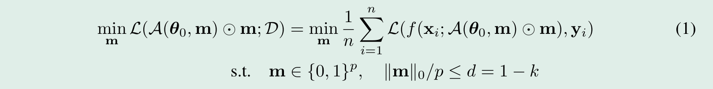

直接最小化上式是非常困难的，现在的前瞻剪枝方法通常给每个权重相应的掩码一个显著性分数，广义形式如下，其中 L 是关于参数和掩码的函数。

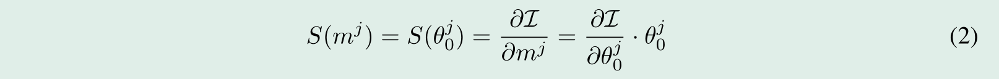

上式评估移除连接对 L 造成的影响，然后保留影响较大的连接。

以下是一些前瞻剪枝的显著性分数计算方式。

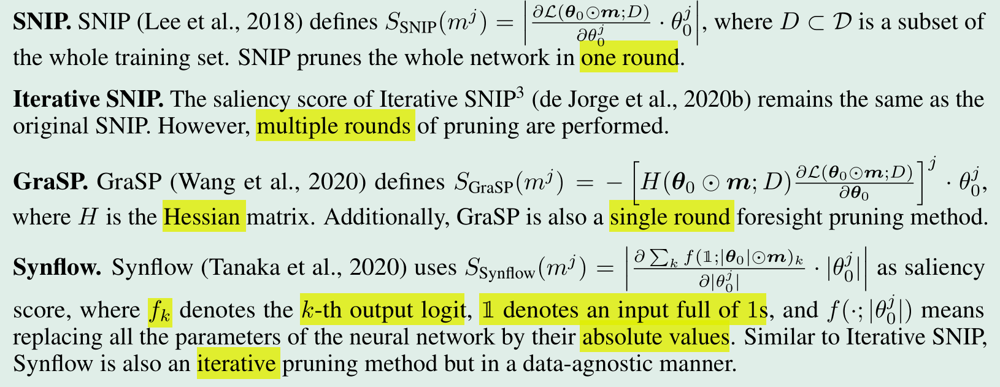

---

## 4. 回顾神经正切核

执行梯度下降的无效宽网络的 training dynamics。

用 $ \D = \{ ({x_i} + {y_i})\} _{i = 1}^n \subset {R^n} \times {R^k}\$ 表示训练集，
用 $ \L(\theta ) = \sum\nolimits_{(x,y) \in D} {l(f(x;\theta ),y)} \$ 表示经验损失， 
则 $ \f({\rm X};\theta ) \subset {R^{kn \times 1}}\$ 表示整个训练集输入的预测的拼接。

在学习率 η 下进行连续时间梯度下降，θ_t 的变化（与时间无关），以及训练集的损失可以表示为下面的式子：

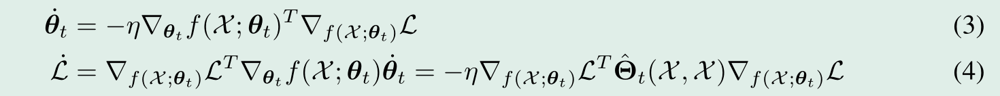

每个时刻 t 的 NTK 可以表示为：


当网络足够宽时，“固定权重 NTK”会收敛到一个确定的矩阵 $\Theta ({\rm{X}},{\rm{X}})\$，也就是“解析 NTK”。

### 4.1 NTK 的条件数与网络优化的关系

NTK 的最大特征值为 λ_max，则最大学习率不能超过 2/λ_max，网络才能够收敛到全局最小值。

参考[大学习率区域的弹弓效应](https://zhuanlan.zhihu.com/p/139678570)。

NTK 的条件数即 k = λ_max/λ_min，最小特征值以比率 1/k 成指数收敛，如果 k 发散，那么网络不可训练。

### 4.2 使用整个 NTK 谱是一种更好的估计

传统优化理论中，收敛速度取决于 Hessians 矩阵的全体特征值。

一些文献表明神经网络的收敛速度取决于特征值而不是最小特征值。与只考虑NTK的条件数相比，获取整个特征谱可能是保证优化性能的更好方法。

---

## 5. 作者的方案

### 5.1 用迹范数来代表整个特征谱的影响

NTK 谱能很好地描述一个宽网络的 training dynamics，因此如果一个剪枝后的网络能够保持与原来的谱足够相似，那么它就很可能与原网络有着相似的表现。

为提高计算效率，使用谱的迹范数而不是计算整个谱。（一些文献会使用特征值的均值）

使用权重的显著性得分来表示它们的连接与断开对迹范数的影响，较小的得分意味着它对特征值分布造成的影响也可能较小。

### 5.2 近似 NTK 的迹范数

由于 NTK 是对称的，所以迹范数可以表示为输出对参数的雅可比矩阵的斐波那契范数。

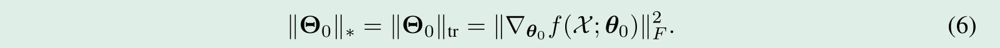

直接计算雅可比矩阵是困难的，它的大小是 kn x p（p 是参数的总量）。

替代性地，使用有限差分表达式，以及近似于训练数据集的剪枝数据集，来计算显著性得分。


### 5.3 NTK-SAP: 多次采样表示

简单说就是使用多次采样计算的结果（期望）来近似“解析NTK”。

采样 R 次，每次都使用不同的参数配置（重新初始化参数，kaiming_normal），因此作者认为 NTK-SAP 不依赖于权重。

作者接着引入 NINW 技巧，即对于剪枝数据集（每次采样使用一个新的数据集）中的若干个 batch，每个 batch 使用不同的参数配置，减少计算量。

作者进一步发现剪枝数据集可以用高斯噪声来替代，而不是训练集的子集，这意味着 NTK-SAP 不依赖于数据。

对参数的扰动 ∆θ 同样是一个高斯分布，理论上应当多次采样，然而实验发现一次采样足矣。最终的显著性得分如下：

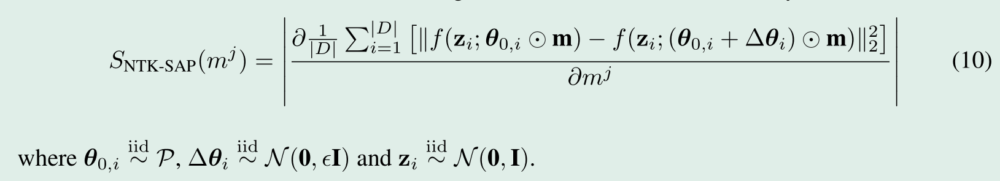

此外，为了避免发生层坍塌，算法采样迭代剪枝，在 T 次剪枝中逐步得到预定的稀疏度。算法的伪代码如下：

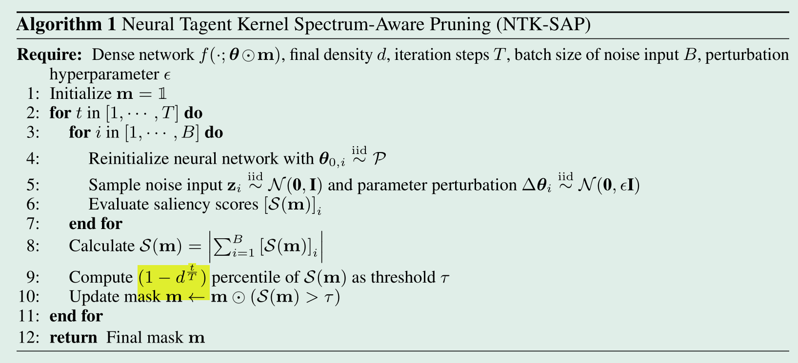

关于该算法的计算开销，主要来自于两次前向传播，因此近似为 iteration SNIP 的两倍，
然而考虑到 NTK-SAP 不依赖于数据，且可以通过减小 T 来缩短计算时间，这种开销就是可以接受的。

---

## 6. 实验

作者的开源代码仓库 [NTK-SAP]( https://github.com/YiteWang/NTK-SAP)。

项目结构如下：
  - utils.py: 绘图工具，以及各实验的配置。
  - dataload.py: 加载和 cifar-10 数据集、 cifar-100 数据集和 tiny-imagenet 数据集。
  - train.py: 训练网络，评估测试集精确率。
  - pruner.py: 实现 NTK-SAP 的剪枝器。
  - network.py: 主要是 resnet 和 vgg。

算法实现的类如下。

对于给定的网络，在 prune 中复制两个相同的网络，并储存对应的权重和相应的 mask。

```python
class Pruner:
    def __init__(self, epsilon, final_s):
        self.epsilon = epsilon
        self.final_s = final_s
        self.weight_num = 0
        self.masks = {}
        self.parameters = {}
        self.perturb_parameters = {}

    def init_parameters(self):
        for _, weight in self.parameters.items():
            nn.init.kaiming_normal_(weight)

        for name, weight in self.perturb_parameters.items():
            weight.data = self.parameters[name].data + torch.randn(*weight.shape, device=weight.device) * self.epsilon

    def compute_score(self, T, R, data_iter, net1, net2, device):

    @staticmethod
    def apply_mask(module, mask):
        mask.require_grad = False
        nn.init.kaiming_normal_(module.weight)
        module.weight.data *= mask
        module.weight.register_hook(lambda grad: grad * mask)  # 冻结梯度

    def prune(self, net, T, R, size, batch_size, NTK_show=False):
        device = next(net.parameters()).device

        net1 = copy.deepcopy(net)
        for name, module in net1.named_modules():
            if isinstance(module, nn.Linear) or isinstance(module, nn.Conv2d):
                module.weight.requires_grad = False
                self.masks[name] = torch.ones_like(module.weight, requires_grad=True, device=device)
                module.mask = self.masks[name]
                module.forward = types.MethodType(mask_forward_conv2d
                                                  if isinstance(module, nn.Conv2d) else mask_forward_linear, module)
                self.parameters[name] = module.weight
                self.weight_num += module.weight.numel()

        net2 = copy.deepcopy(net1)
        for name, module in net2.named_modules():
            if isinstance(module, nn.Linear) or isinstance(module, nn.Conv2d):
                module.mask = self.masks[name]
                self.perturb_parameters[name] = module.weight

        data_iter = load_prune_data(size, batch_size, device)
        self.compute_score(T, R, data_iter, net1, net2, device)

        if NTK_show:
            dense_eigenvalues = self.compute_NTK(net, size, device)

        for name, module in net.named_modules():
            if isinstance(module, nn.Linear) or isinstance(module, nn.Conv2d):
                self.apply_mask(module, self.masks[name])
            if isinstance(module, nn.BatchNorm2d):  # Reset momentum of BatchNorm2d
                module.momentum = 0.1

        del net1, net2

        if NTK_show:
            sparse_eigenvalues = self.compute_NTK(net, size, device, reinit=False)
            return dense_eigenvalues, sparse_eigenvalues

    def compute_NTK(self, net, size, device, reinit=True):
```

之后在 compute_score 实现前述算法，确定需要修剪的连接后对原网络重新初始化后再修剪，并冻结相应梯度。

值得注意的是，作者着重强调对 BN 层的处理，先重置 BN 层状态，
然后在 train 模式下为当前 batch 的数据计算均值和方差，最后在 eval 模式（不改变 BN）下实施剪枝。

```python
    def compute_score(self, T, R, data_iter, net1, net2, device):
        # momentum 设为1，为每个 batch 的数据独立计算均值和方差
        for module_1, module_2 in zip(net1.modules(), net2.modules()):
            if isinstance(module_1, nn.BatchNorm2d):
                module_1.momentum = 1.0
                module_2.momentum = 1.0

        for t in range(T):  # 剪枝 T 次，逐次达到最终稀疏度
            for _ in range(R):  # 采样 R 次
                for data in data_iter:  # NINP
                    self.init_parameters()
                    X = torch.randn_like(data, device=device)

                    reset_BN(net1)
                    reset_BN(net2)
                    net1.train()
                    net2.train()
                    with torch.no_grad():  # 为每个 batch 的数据独立计算均值和方差
                        net1(X)
                        set_BN(net1, net2)
                    net1.eval()
                    net2.eval()

                    y1 = net1(X)
                    y2 = net2(X)
                    term = torch.sum((y2 - y1) ** 2)
                    term.backward()

            # 已经被遮盖的位置不在考虑其梯度，即不会再连接
            masks_grad = [(mask.grad * (mask.detach() != 0)).view(-1) for mask in self.masks.values()] 
            score = torch.abs(torch.cat(masks_grad))
            keep_weight_num = int((1 - self.final_s) ** ((t + 1) / T) * self.weight_num)
            threshold = torch.topk(score, keep_weight_num)[0][-1]
            with torch.no_grad():
                cnt = 0
                for mask in self.masks.values():
                    p = torch.abs(mask.grad) * (mask.detach() != 0)
                    mask[:] = (p >= threshold).float()
                    mask.grad.data.zero_()
                    cnt += torch.sum(mask != 0)
                # print(t, threshold, keep_weight_num, cnt)
```

### 6.1 cifar 与 tiny-imagenet 的结果

实验设定：

剪枝数据集的总数为 类别数 * 10，默认 R = 5。

CIFAR-10: epoch, batch_size, lr = 160, 128, 0.1，优化算法为 SGD，momentum=0.9，weight_decay=1e-4， 

T, prune_batch_size, epsilon = 20, 256, 1.e-2，

学习率衰减 10x at milestones=[80, 120]。

CIFAR-100: epoch, batch_size, lr = 160, 128, 0.1，优化算法为 SGD，momentum=0.9，weight_decay=5e-4, nesterov=True 

T, prune_batch_size, epsilon = 100, 256, 1.e-2，

学习率衰减 10x at milestones=[60, 120]。

tiny-imagenet: epoch, batch_size, lr = 200, 256, 0.2，优化算法为 SGD，momentum=0.9，weight_decay=5e-4， 

T, prune_batch_size, epsilon = 100, 256, 1.e-2，

学习率衰减 10x at milestones=[100, 150]。

作者结果如下，在稀疏度小于 98.2%，优于其他的剪枝方法。

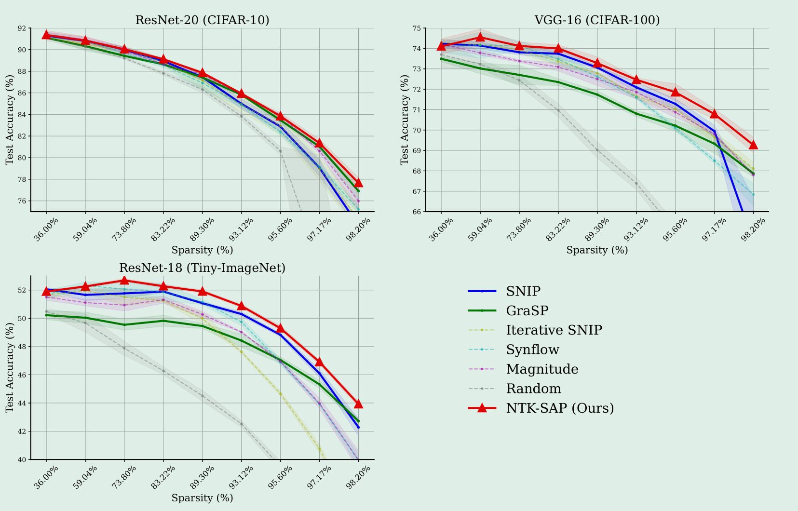

cifar-10 结果基本吻合

.png)

cifar-100 结果基本吻合

.png)

tiny-imagenet 居然高将近 10 个百分点，检查了数据增强，实验配置，好像只有 prune_batch 改小了，因为单卡内存不够。

数据也来自于 [CS231n: Deep Learning for Computer Visio](http://cs231n.stanford.edu)，应该没有问题。不知道哪的问题。

.png)

### 6.2 更大数据集上的结果

作者在 ImageNet 数据集上使用 ResNet-18 and ResNet-50，并分别在 {89.26%, 95.60%} 进行实验。

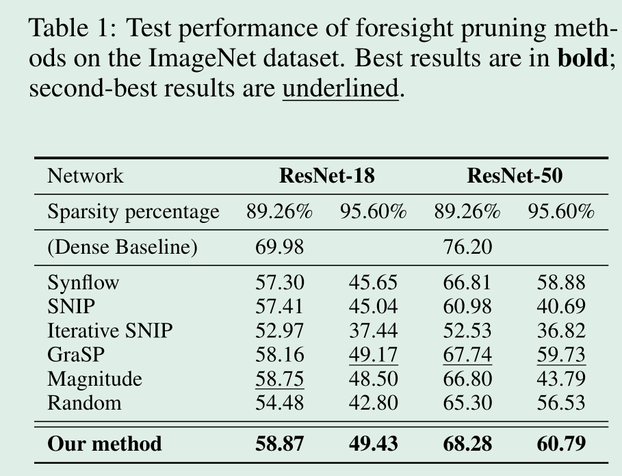

### 6.3 与 SNIP 和 GRASP 的整体比较

SNIP 在小数据集上表现良好，尤其是较低和中等的稀疏度，然而在 ImageNet 上表现不佳（不如 random）。

GRASP 在 ImageNet 和小数据集的高稀疏度上表现优异，但在小数据集的中低稀疏度上表现不佳。

NTK-SAP 是首个在所有数据集上表现良好的前瞻剪枝算法。

### 6.4 消融实验

在附录 C 中，作者调整参数 T。

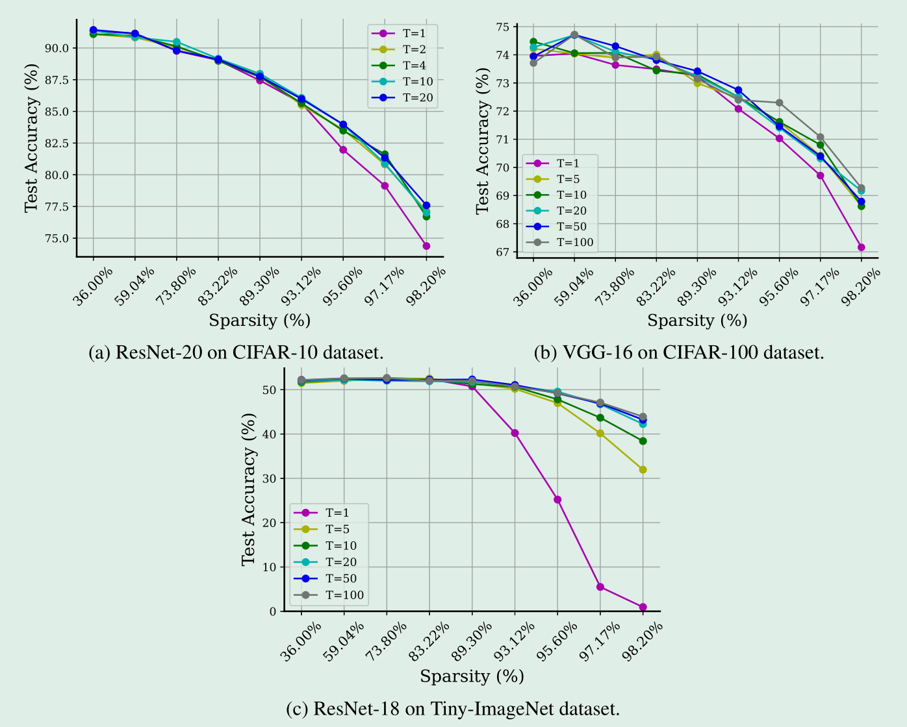

ResNet-20 on CIFAR-10 dataset 实验结果如下。

%20muti_T.png)

在附录 I 中，作者使用不同的超参数 epsilon 进行实验。

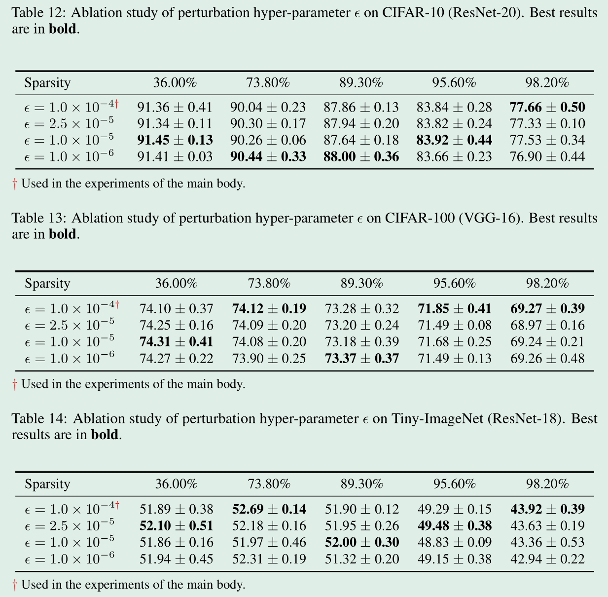

ResNet-20 on CIFAR-10 dataset 实验结果如下，结果显示算法对于不同的 ϵ 都是鲁棒的。

%20muti_e.png)

### 6.5 剪枝后 “固定权重 NTK”的特征谱

为了可视化 NTK-SAP 的有效性，作者在附录 G.1 展示了经过剪枝后的网络 ResNet-20 的 NTK 谱。

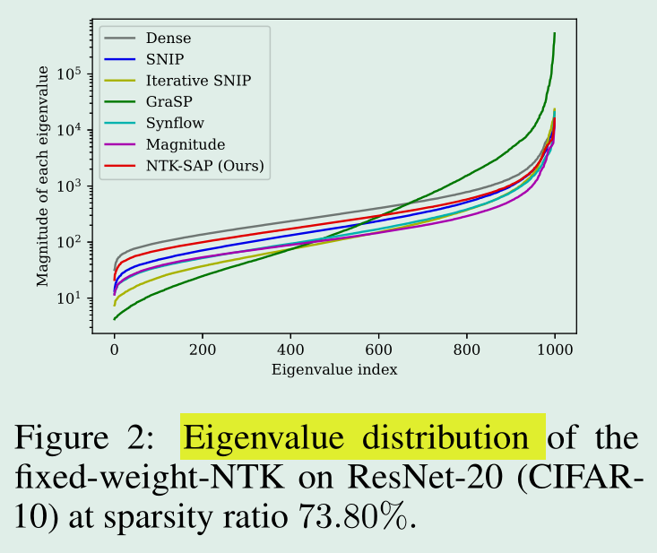

计算方式参考 Section 4，作者将所有输入的预测结果拼接，对权重微分。对于 cifar-10 数据集，num_claass=10，剪枝数据集大小为100，
故 NTK 大小为 1000x1000，特征值数为1000。

```python
    def compute_NTK(self, net, size, device, reinit=True):
        parameters = {}
        for name, module in net.named_modules():
            if isinstance(module, nn.Linear) or isinstance(module, nn.Conv2d):
                parameters[name] = module.weight
                if reinit:
                    nn.init.kaiming_normal_(module.weight)

        res = []
        X = torch.randn(*size, device=device)
        num_classes = size[0] // 10
        for x in X:
            y_hat = net(torch.unsqueeze(x, dim=0)).squeeze(dim=0)
            for i in range(num_classes):
                y_hat[i].backward(retain_graph=(i < num_classes-1))
                cur = []
                for weight in parameters.values():
                    cur.append(torch.clone(weight.grad).view(-1))
                    weight.grad.data.zero_()
                res.append(torch.cat(cur))

        P = torch.stack(res)
        eigenvalues, _ = torch.linalg.eig(P @ P.T)
        return torch.abs(eigenvalues).detach().cpu()
```

实验结果如下。可以看到，随着稀疏度的逐渐增加，剪枝后的网络在较小的特征值（这些特征往往对应于噪声）上与原网络的差异逐渐扩大，
但是在极大的特征值（主成分，这些特征往往对应于最重要的一部分特征）上保持一致。

<table>
<td> 
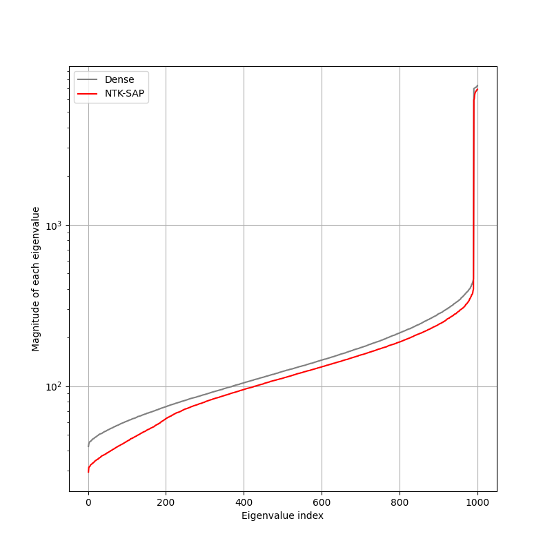 <br>
<font color="AAAAAA">sparsity: 36.00%</font>
</td> 
<td> 
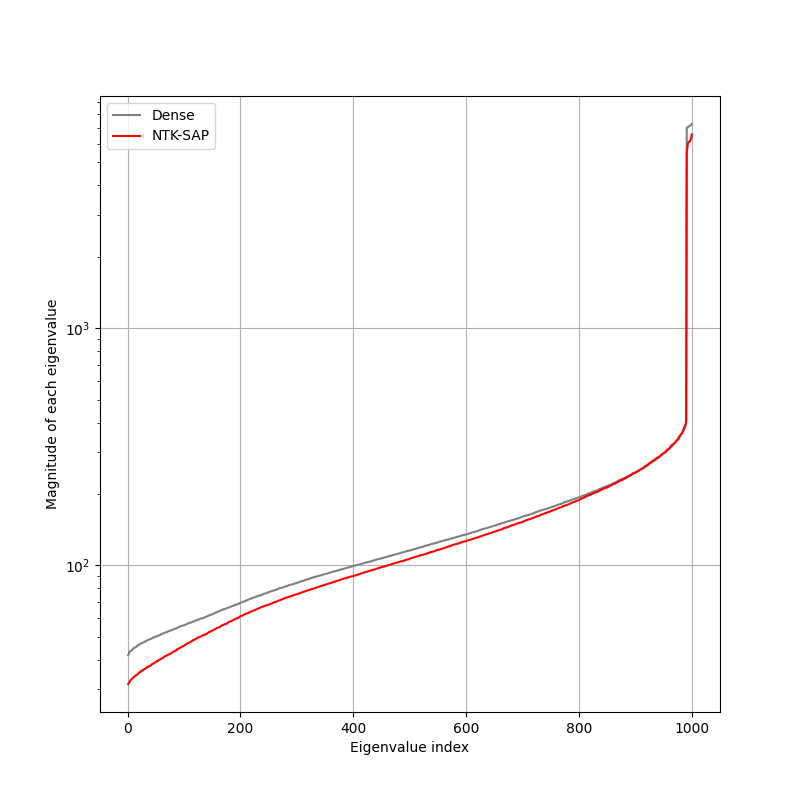 <br>
<font color="AAAAAA">sparsity: 59.04%</font>
</td> 
<td> 
 <br>
<font color="AAAAAA">sparsity: 73.80%</font>
</td>
</table>
<table>
<td> 
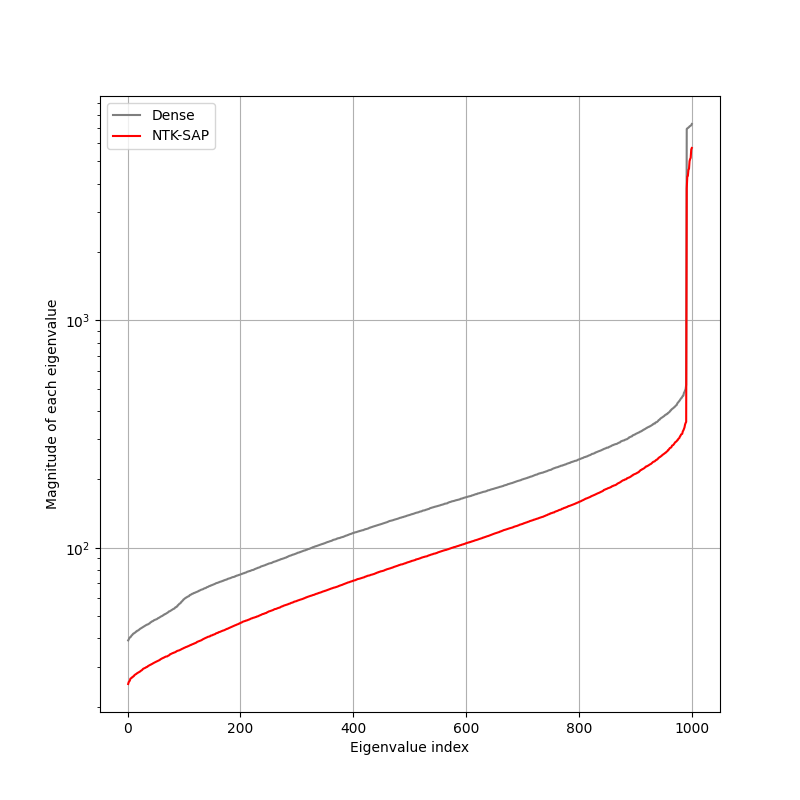 <br>
<font color="AAAAAA">sparsity: 83.22%</font>
</td> 
<td> 
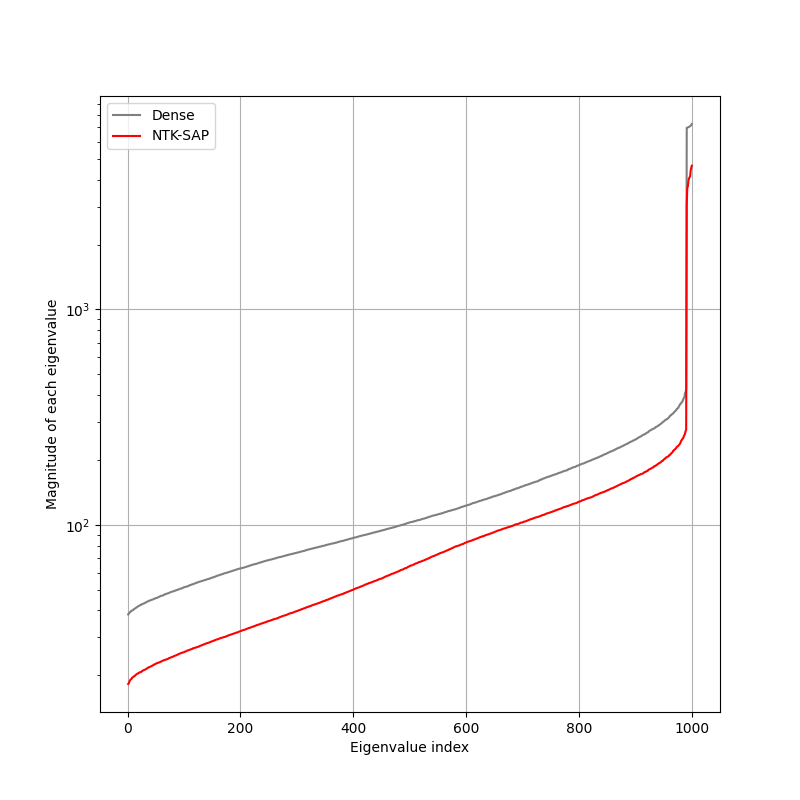 <br>
<font color="AAAAAA">sparsity: 89.30%</font>
</td> 
<td> 
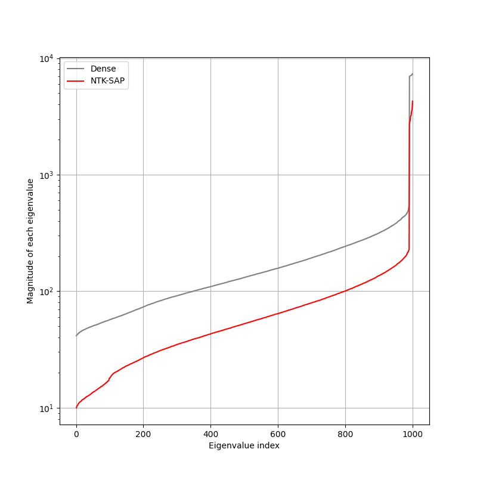 <br>
<font color="AAAAAA">sparsity: 93.12%</font>
</td>
</table>
<table>
<td> 
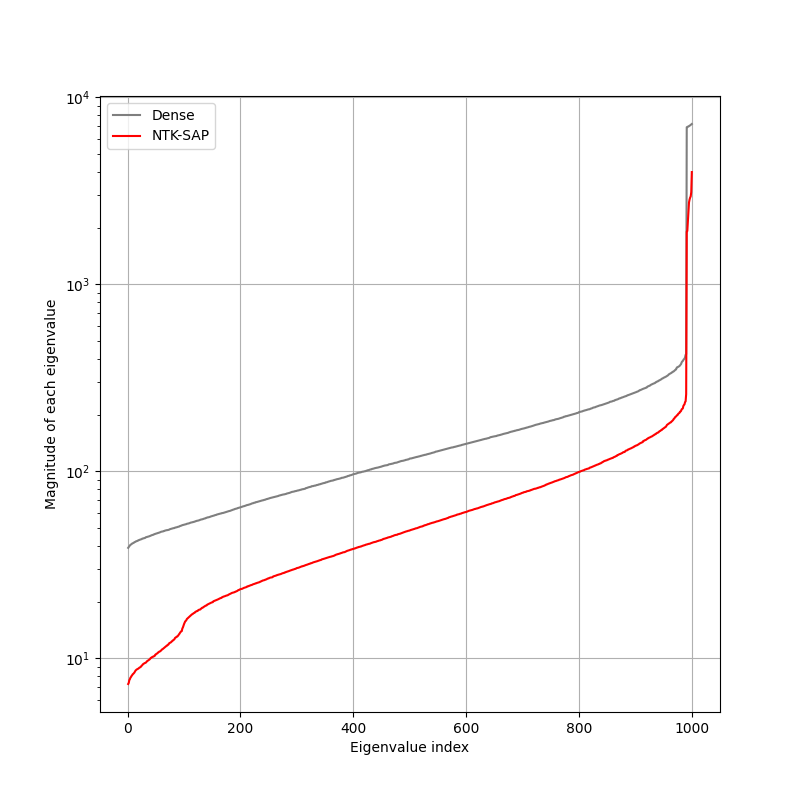 <br>
<font color="AAAAAA">sparsity: 95.60%</font>
</td> 
<td> 
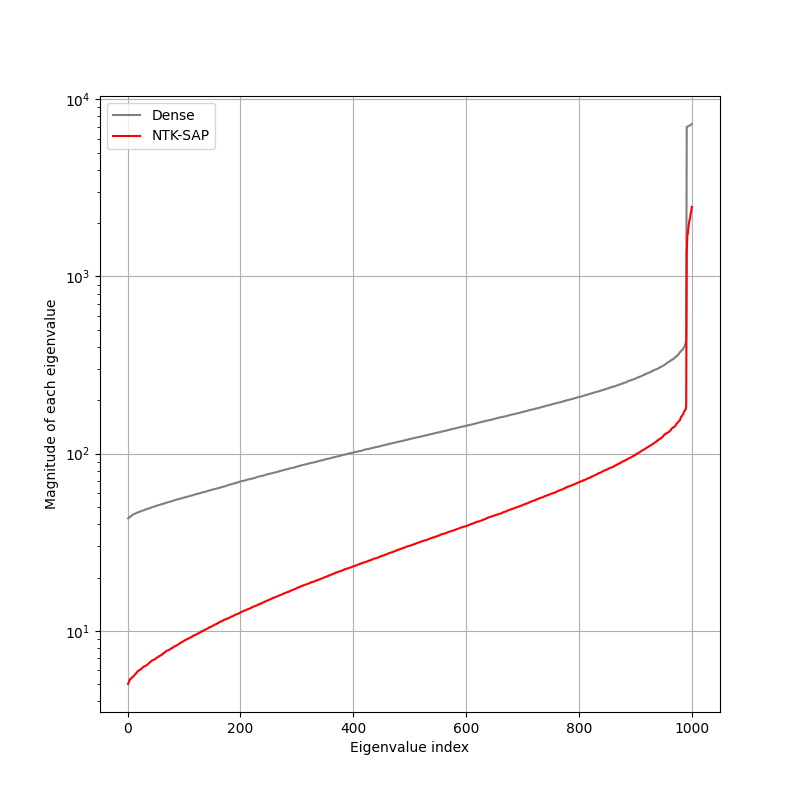 <br>
<font color="AAAAAA">sparsity: 97.17%</font>
</td> 
<td> 
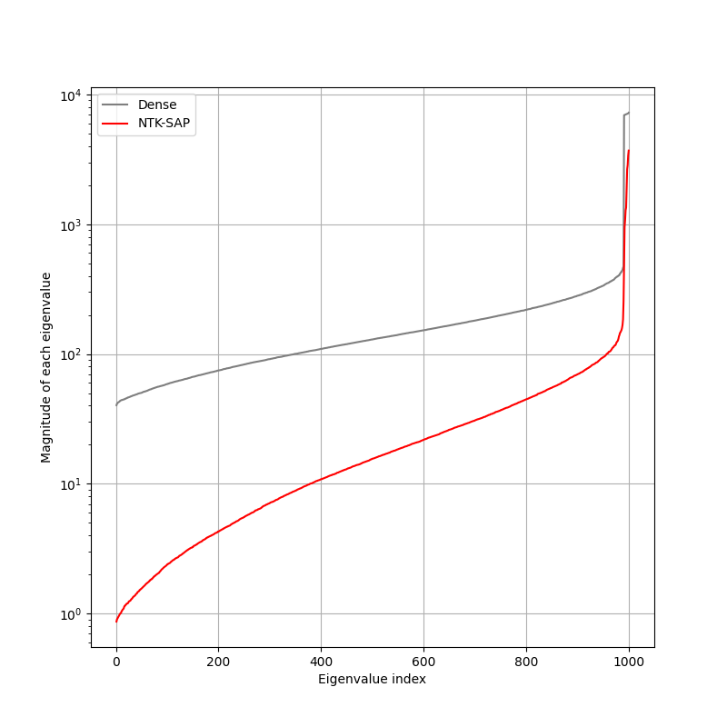 <br>
<font color="AAAAAA">sparsity: 98.20%</font>
</td>
</table>

## 7.讨论

NTK-SAP 的表现鼓励更多工作聚焦于将理论发现应用于实践应用，创新性地结合多次初始化配置的方法进一步鼓励未来工作探索
剪枝和 NAS （Neural Architecture Search，一种自动搜索神经网络结构的技术）的相似性。

相比于一次性剪枝，NTK-SAP 的缺陷在于迭代剪枝带来的巨大计算量。

---

## Neural Tangent Kernel

### simple conclusion

总的来说，NTK 衡量的是，在使用 SGD 优化参数下，对于随机抽到的样本 x'，参数更新非常一小步后，f(x) 的变化：

$$
\mathop {\lim }\limits_{\eta  \to 0} \frac{{(f(x,\theta ) - f'(x,\theta )\eta \frac{{\partial L}}{{\partial {f_\theta }(x')}}\frac{{\partial {f_\theta }(x')}}{{\partial \theta }}) - f(x,\theta )}}{\eta } \
$$

对 f 进行泰勒近似，即 f(x+Δx) ≈ f(x) + f'(x)Δx，则：

$$
\mathop {\lim }\limits_{\eta  \to 0} \frac{{(f(x,\theta ) - f'(x,\theta )\eta \frac{{\partial L}}{{\partial {f_\theta }(x')}}\frac{{\partial {f_\theta }(x')}}{{\partial \theta }}) - f(x,\theta )}}{\eta } = - f'(x,\theta )\frac{{\partial L}}{{\partial {f_\theta }(x')}}\frac{{\partial {f_\theta }(x')}}{{\partial \theta }} = - \frac{{\partial L}}{{\partial {f_\theta }(x')}} < \frac{{\partial {f_\theta }(x)}}{{\partial \theta }},\frac{{\partial {f_\theta }(x')}}{{\partial \theta }} > \
$$

定义数据集 X 样本总数量为 n，则对于数据集中的任译样本 x_j，其输出的变化为：

$$
\mathop f\limits^. ({x_j};\theta ) = - f'({x_j},\theta )\frac{{\partial L}}{{\partial {f_\theta }(X)}}\frac{{\partial f(X;\theta )}}{{\partial \theta }} = - \frac{{\partial f({x_j};\theta )}}{{\partial \theta }}\sum\limits_{i = 1}^n {\frac{{\partial L}}{{\partial {f_\theta }({x_i})}}\frac{{\partial f({x_i};\theta )}}{{\partial \theta }}}  = - \sum\limits_{i = 1}^n {\frac{{\partial L}}{{\partial {f_\theta }({x_i})}} < \frac{{\partial f({x_i};\theta )}}{{\partial \theta }}} ,\frac{{\partial f({x_j};\theta )}}{{\partial \theta }} > \
$$

记整体样本的输出为 u(t) = f(X;θ)，则其变化率为：

$$
\mathop u\limits^. (t) =  - \frac{{\partial f(X;\theta )}}{{\partial \theta }}{\frac{{\partial f(X;\theta )}}{{\partial \theta }}^T}\frac{{\partial L}}{{\partial {f_\theta }(X)}} =  - K(t)\frac{{\partial L}}{{\partial u}}\
$$

显然，K(t) 是一个核，当网络宽度为无限时，会出现以下性质：

1. 如果参数 θ_0 在某种合适的分布下初始化，那么在该初始值下的 K(0) 是一个确定的函数（初始化方差，深度和激活函数的函数），它与初始化无关。
2. 训练中参数的改变并不会改变该核函数，即 K(t) = K(0) = K。

即在无限宽网络中，训练可以理解成一个简单的 kernel gradient descent 的算法，而且kernel是固定的。

当 K 正定时，$ K\frac{{\partial L}}{{\partial u}} $ 始终朝着下降的方向，若其最小特征值不为0，则神经网络的收敛速率和梯度下降一样。

对于 L2 损失，有

$$
\mathop u\limits^. (t) =  - K(y - u(t))\
$$

解这个方程得到：

$$
y - u(t) = {e^{ - Kt}}y\
$$

网络收敛。

原论文[7]中的数学推导很难懂，基本上参考[6]能大概看明白。。。 

### Reference

1. [浅入浅出核方法 (Kernel Method)](https://zhuanlan.zhihu.com/p/131674827)

2. [Kernel regression 和 kernel gradient descent](https://zhuanlan.zhihu.com/p/432554586)

3. [Some Intuition on the Neural Tangent Kernel](https://www.inference.vc/neural-tangent-kernels-some-intuition-for-kernel-gradient-descent/)

4. [如何科学地理解无穷宽神经网络？](https://zhuanlan.zhihu.com/p/392437305)

5. [Neural Tangent Kernel （NTK）基础推导](https://www.cnblogs.com/manuscript-of-nomad/p/17243296.html)

6. [What on Earth is Neural Tangent Kernel?](https://zhuanlan.zhihu.com/p/474897044)

7. [Neural Tangent Kernel: Convergence and Generalization in Neural Networks](https://proceedings.neurips.cc/paper/2018/file/5a4be1fa34e62bb8a6ec6b91d2462f5a-Paper.pdf)

---

## Further

### 1.初始化

网络的参数必须在某种合适的分布下初始化，即 Kaiming Normal Initialization。在该初始化下无穷宽网络的 NTK 是确定的，与初始化的具体值无关。

Kaiming Normal Initialization 目的在于保持每一层的输出（激活前）在前向传播中不受每层神经元数量变化影响，
保持标准差大约为1，这样可以允许我们堆叠更多层而不会出现梯度爆炸或消失。

具体推导参考[5] 初始化：Kaiming Initialization / He Initialization 部分。

显然，这种初始化下，输入也应当被初始化为一个符合标准正态分布的 d 维矢量，这大概也是文中采用 gaussian noise 作为输入的原因。

### 2.more

#### [NEURAL ARCHITECTURE SEARCH ON IMAGENET IN FOUR GPU HOURS:A THEORETICALLY INSPIRED PERSPECTIVE](https://openreview.net/pdf?id=Cnon5ezMHtu)

提出一种称为无训练神经网络架构搜索（TE-NAS）的新颖框架。TE-NAS 通过分析神经切核（NTK）的谱和输入空间中线性区域的数量来对体系结构进行排名。

这两个指标可以在无需训练和标签的情况下进行测量，从而显著减少了搜索成本：
（1）这两个测量结果暗示了神经网络的可训练性（网络通过梯度下降优化能有多高效）和表达能力（网络能代表多复杂的功能）。
将梯度下降的过程用无限或有限宽度的网络的神经正切核(NTK)表示，这样就能够在网络初始化的时候衡量网络的可训练性；
通过计算神经网络可以在其输入空间划分的唯一线性空间的个数来衡量网络的表达性。
（2）它们与网络的测试准确性密切相关。

最小化 NTK 的条件数 k 可以找到性能好的网络，而最大化线性区域数量 R 更容易找到高性能的网络。

由于 k 和 R 的值有很大不同，不太能将它们关联起来，所以使用相对值来关联。
具体而言就是每次将采样的一对网络进行比较，通过 k 和 R 的相对排序作为选择标准，并且它们是等权重的，这样能够平等地表示网络的可训练性和表达性。

在 NAS-Bench-201 和 DARTS 搜索空间中，TE-NAS 可以完成高质量的搜索。
在ImageNet上使用一个1080Ti搜索只需花费4个GPU小时，搜索速度上提升很大。

#### [Over-parameterised Shallow Neural Networks with Asymmetrical Node Scaling:Global Convergence Guarantees and Feature Learning](https://openreview.net/pdf?id=QBOV4DqFh6)

#### [On the Neural Tangent Kernel Analysis of Randomly Pruned Neural Networks](https://arxiv.org/pdf/2203.14328.pdf)

#### other

[Fourier Features Let Networks Learn High Frequency Functions in Low Dimensional Domains](https://papers.nips.cc/paper/2020/file/55053683268957697aa39fba6f231c68-Paper.pdf)

[Yarn: Efficient context window extension of large language models](https://arxiv.org/abs/2309.00071)